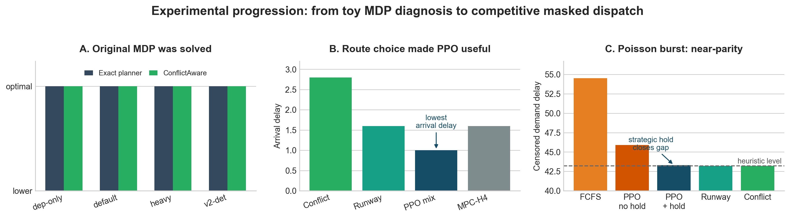
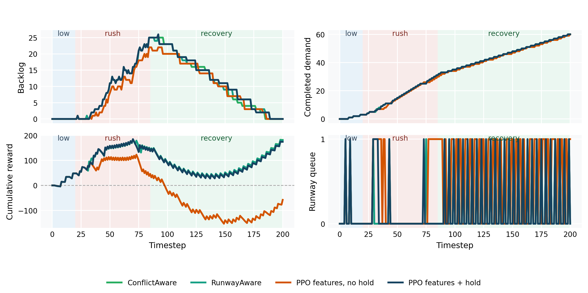

# Airport Surface Scheduling with Masked PPO

COS435 / ECE433 final project by Biruk Desta, Hassan Khan, and Keith Torpey.

This repository contains a stylized airport-surface scheduling benchmark. A
centralized dispatcher issues aircraft clearances through gates, taxiway spots,
intersections, route choices, a runway threshold queue, and timed runway service.
The project compares MaskablePPO with handcrafted scheduling heuristics and
planning baselines under deterministic route-choice scenarios and stochastic
Poisson demand.

## Project Explainer Video

For a short visual explanation of the project arc, watch the explainer video:


The explainer walks through the main story:

1. The original fixed-route MDP was too easy because ConflictAware matched exact
   planning.
2. Route choice introduced a real short-route-vs-bypass tradeoff.
3. Bursty Poisson demand shifted the problem toward backlog/runway metering.
4. MaskablePPO became operationally competitive only after demand-aware
   observations, valid-action masks, strategic hold/no-op, and longer training.

## Same-Seed Rollout


The animation compares RunwayAware and PPO with demand-aware features plus
strategic hold under the same Poisson burst seed.

## What This Implements

- Fixed-route, route-choice, and Poisson traffic scenarios.
- Short-vs-bypass departure routing.
- Arrival/departure conflicts at a shared central bottleneck.
- Runway threshold queue and timed runway service.
- Active-slot recycling for generated Poisson demand.
- Timestamped backlog requests and horizon-censored demand-delay metrics.
- Legal-action masks for MaskablePPO.
- Strategic no-op/hold actions for metering under bursty demand.
- Baselines: FCFS, ConflictAware, RunwayAware, route-choice heuristics, MPC-H4/H6,
  and a legacy exact planner for small fixed-route diagnosis.

## Main Result

The original fixed-route MDP is too easy: a conflict-aware greedy policy matches
the exact planner. Route choice creates the first useful learned-control setting,
where MaskablePPO learns mixed routing. In bursty Poisson demand, demand-aware
features plus strategic hold/no-op let MaskablePPO reach near-parity with the
strongest handcrafted heuristics on operational metrics, while still slightly
trailing on shaped reward.

Final bursty Poisson evaluation:

| Policy | Censored demand delay | Done/generated | Unserved | Timeout | Surface delay | Reward |
|---|---:|---:|---:|---:|---:|---:|
| ConflictAware | 43.2 | 52.0/53.4 | 1.3 | 32.0% | 8.8 | 175.7 |
| RunwayAware | 43.2 | 52.0/53.4 | 1.3 | 32.0% | 8.8 | 175.4 |
| PPO features + hold | 43.3 | 52.0/53.4 | 1.3 | 32.0% | 8.8 | 168.3 |
| PPO features, no hold | 45.9 | 51.7/53.4 | 1.7 | 35.3% | 11.3 | -65.6 |
| FCFS | 54.5 | 51.7/53.4 | 1.6 | 30.0% | 15.4 | -1134.8 |

The final learned policy reaches near-parity with the strongest heuristics on
the operational metrics, but it does not dominate them on shaped reward.

## Visual Summary





Final visual assets are tracked under `experiments/figures/`:

```text
experiments/figures/final_results_overview_flat.png
experiments/figures/poisson_burst_report_rollout_flat.png
experiments/figures/poisson_burst_runwayaware_vs_ppo_hold.gif
```

The rendered project explainer video is under `media/videos/project_explainer/`.

## Setup

Requires Python 3.12.

```bash
python3.12 -m venv rl
source rl/bin/activate
pip install -r requirements.txt
```

## Quick Checks

Verify the simulator:

```bash
python simulator.py
```

Verify the Gymnasium environment:

```bash
python -c "from env.airport_env import AirportEnv; from stable_baselines3.common.env_checker import check_env; check_env(AirportEnv()); print('env OK')"
```

## Training

Train a MaskablePPO model:

```bash
python training/train.py --only ppo_route_choice_mix --maskable --seed 0
```

Train the final Poisson model:

```bash
python training/train.py --only ppo_poisson_mix_features_hold_long --maskable --seed 0
python training/train.py --only ppo_poisson_mix_features_hold_long --maskable --seed 1
python training/train.py --only ppo_poisson_mix_features_hold_long --maskable --seed 2
```

Checkpoints are written to `experiments/models/`.

## Evaluation and Plots

Run all configured evaluations:

```bash
python evaluation/evaluate.py
```

Generate summary plots:

```bash
python visualization/plots.py
```

Generate the same-seed rollout animation:

```bash
python visualization/rollout_animation.py
```

Generated CSVs, model checkpoints, TensorBoard logs, and intermediate plots are
not tracked by default.

## Repository Structure

```text
simulator.py              Core simulator and scenario logic
experiments.py            Experiment/model/scenario registry
baselines/                Heuristic, MPC, and exact-planner baselines
env/                      Gymnasium wrapper and action masks
training/                 PPO/MaskablePPO training entry point and configs
evaluation/               Evaluation runner and metric aggregation
visualization/            Plot and rollout-animation scripts
experiments/figures/      Selected final visual assets
media/videos/             Optional rendered explainer videos
```

## Code Attribution

RL training uses off-the-shelf PPO from Stable-Baselines3 and MaskablePPO from
SB3-Contrib. The simulator, Gymnasium wrapper, legal-action masks, route-choice
and Poisson scenarios, handcrafted baselines, metrics, plots, and evaluation
scripts are project-specific implementations for this class project.
